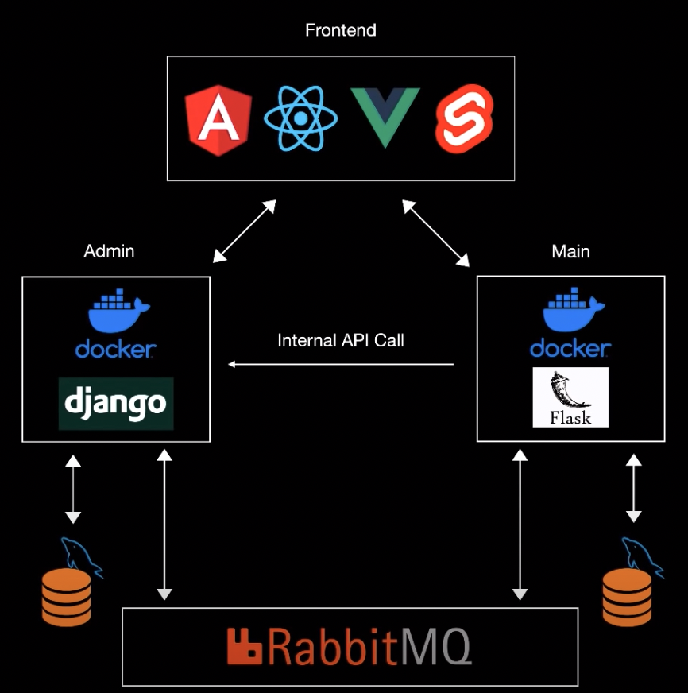

# Microservices Practice Python
Python + React Microservices Web App - following this [YouTube tutorial]( https://www.youtube.com/watch?v=0iB5IPoTDts)

Using [React Frontend](https://github.com/spencerlepine/microservices-practice-react)

